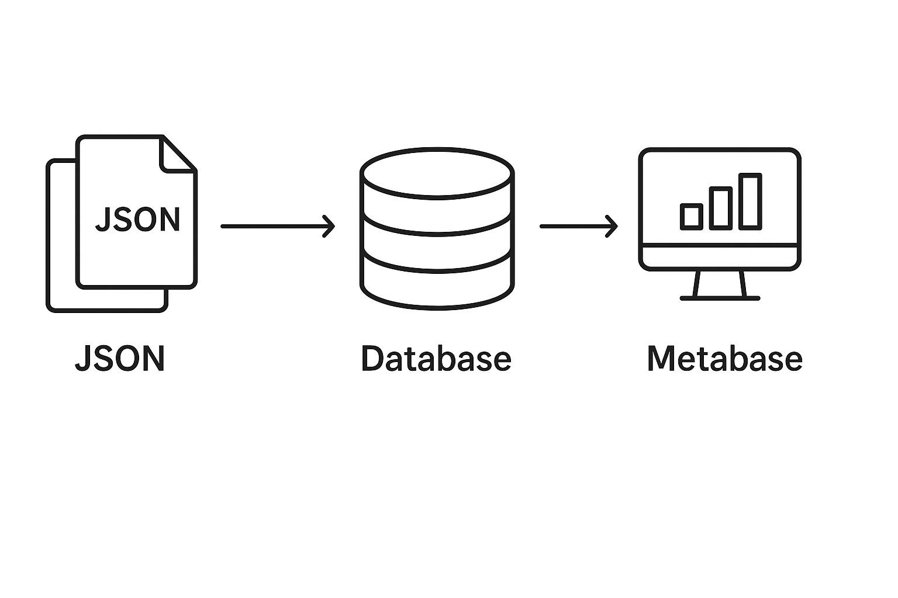
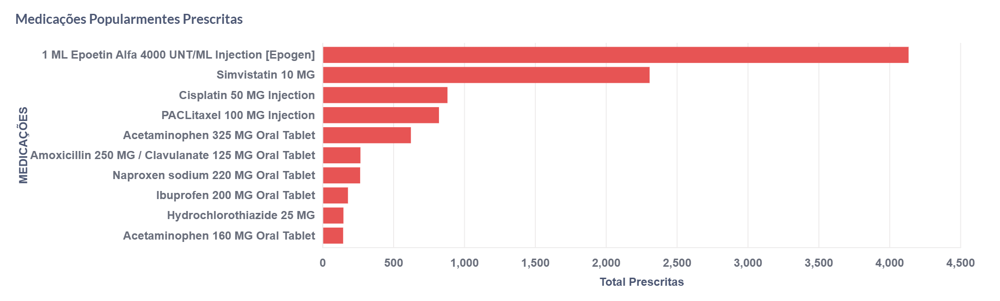
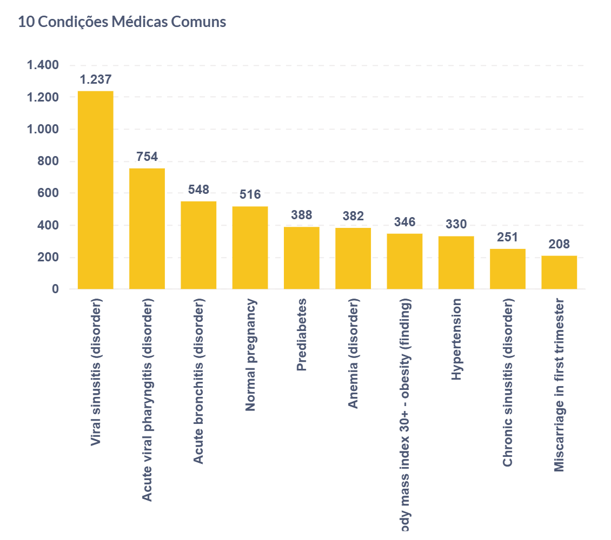
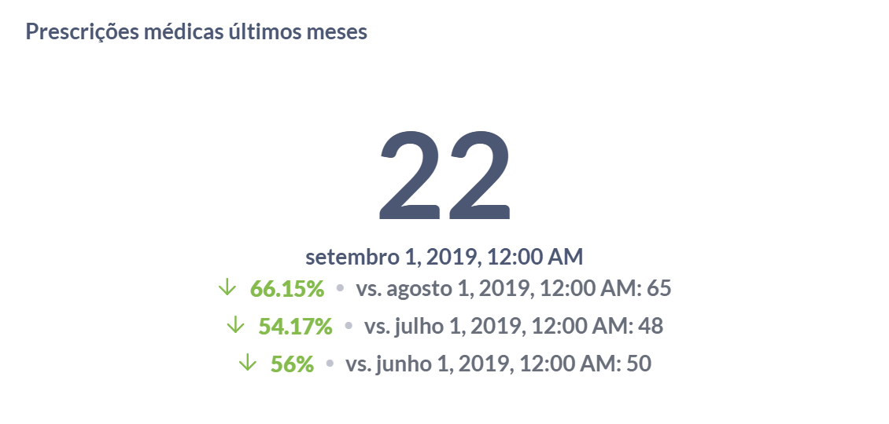

# Arquitetura do Projeto
Este documento descreve a arquitetura do projeto que envolve a extração, transformação e carregamento de dados de arquivos JSON para um banco de dados PostgreSQL, seguido da visualização e análise desses dados no Metabase.

## Fluxo de Dados
O fluxo de dados do sistema ocorre da seguinte forma:

- **Coleta de Dados:** Os arquivos JSON contendo informações sobre pacientes são armazenados em uma pasta local.

- **Processamento:** Um script em Python faz a leitura dos arquivos JSON, extrai as informações relevantes e transforma os dados para adequação ao esquema do banco de dados.

- **Carga no Banco:** Os dados transformados são inseridos no PostgreSQL.

- **Análise e Visualização:** O Metabase consome os dados do PostgreSQL para geração de dashboards interativos.

##  Componentes da Arquitetura
1. **Arquivos JSON:** 
    
    Os arquivos JSON contêm informações estruturadas sobre pacientes, condições médicas e prescrições.

2. **Script Python**: 
    
    Responsável pela leitura, transformação e inserção dos dados no banco de dados.

3. **Banco de Dados PostgreSQL**

    O PostgreSQL é utilizado para armazenar e gerenciar os dados de forma estruturada, permitindo consultas eficientes.

4. **Metabase**

    Ferramenta de BI utilizada para criar consultas SQL, gerar dashboards e analisar os dados.

## Diagrama da Arquitetura

    

## Consultas e Dashboards
Foram criados diversos dashboards no Metabase, incluindo:

- **Medições mais prescritas** – Gráfico de barras com os medicamentos mais utilizados.
    
    

- **Condições médicas comuns** – Gráfico de barras com as doenças mais frequentes.

    

- **Distribuição por gênero** – Gráfico de pizza mostrando a distribuição dos pacientes por gênero.

    

- **Tendência mensal no total de prescrições** – Gráfico que apresenta a variação mensal no número de prescrições.

    

## Conclusão e Próximos Passos

O projeto foi bem-sucedido na extração, armazenamento e análise dos dados. Como próximos passos, podemos considerar:

- Otimização das consultas SQL para maior eficiência.

- Implementação de novas visualizações no Metabase.

