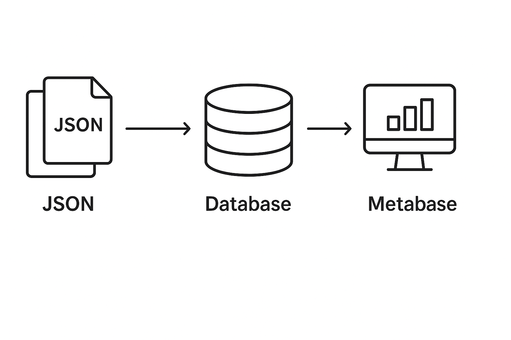
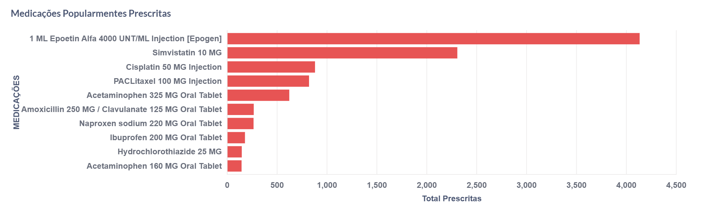
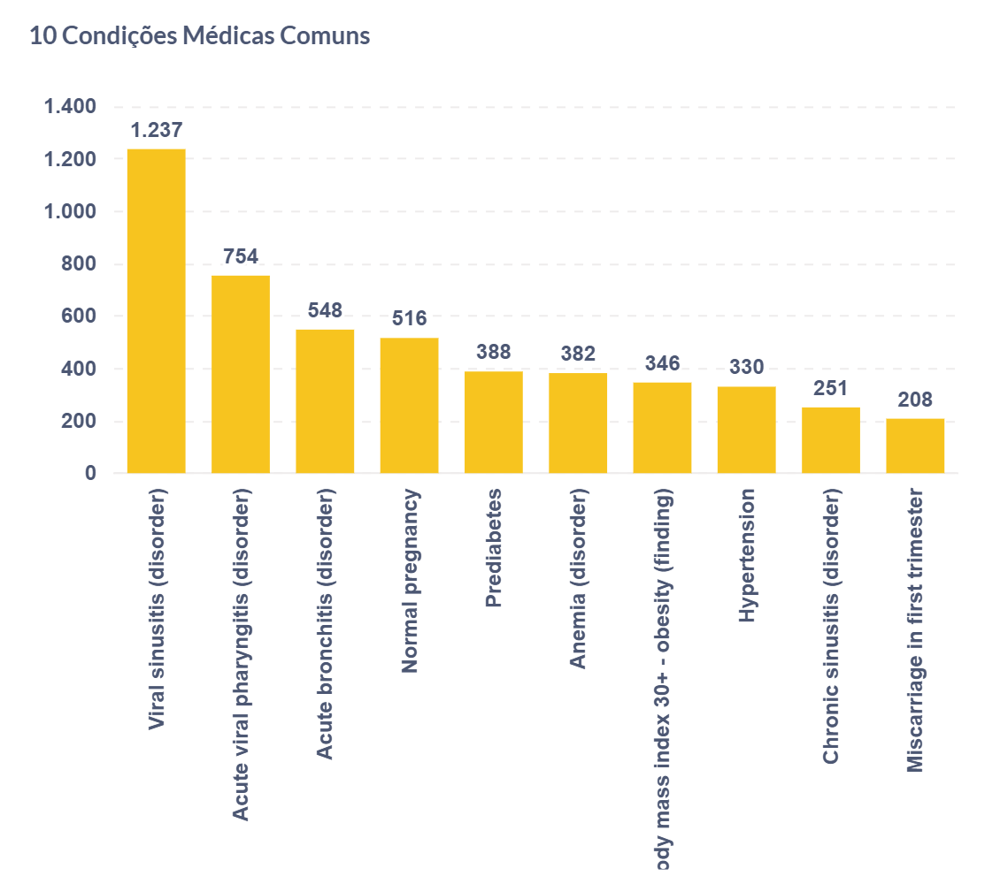
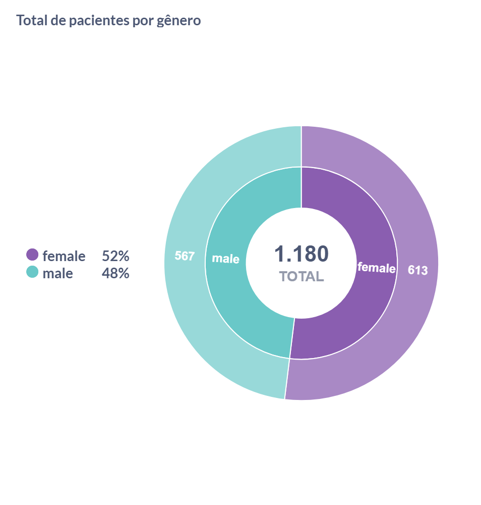
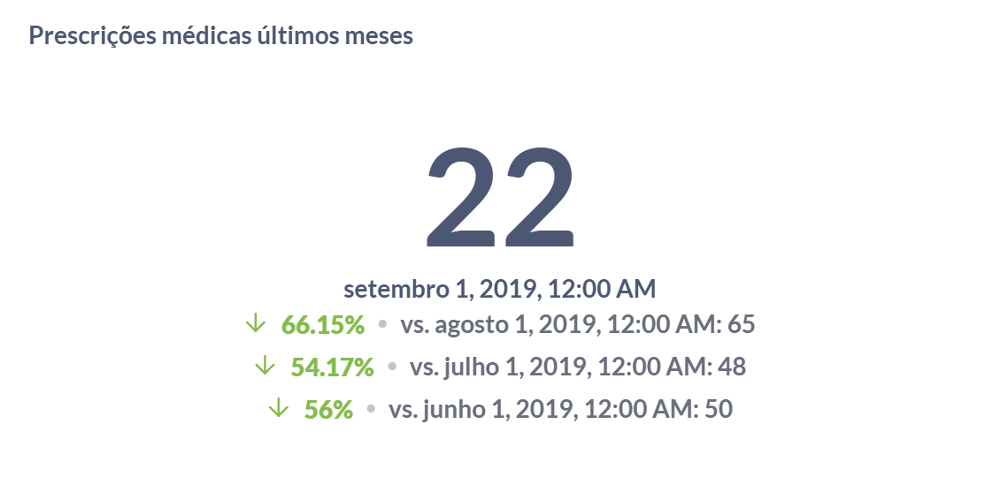

# Documentação da Arquitetura do Projeto

## 📘 Introdução
Este projeto realiza o processo completo de ETL (Extração, Transformação e Carga) de dados no formato JSON contendo informações médicas. Esses dados são processados e inseridos em um banco de dados PostgreSQL e, em seguida, analisados e visualizados por meio do Metabase.

---

## 🔁 Fluxo de Dados

1. **Coleta de Dados**: Os arquivos JSON contendo informações sobre pacientes, condições médicas e prescrições são armazenados localmente.
2. **Transformação (ETL)**: Um script Python percorre os arquivos, extrai dados relevantes e os adapta ao formato necessário.
3. **Carga no PostgreSQL**: Os dados transformados são inseridos no banco de dados relacional PostgreSQL.
4. **Visualização no Metabase**: Os dados podem ser explorados e visualizados via dashboards dinâmicos no Metabase.

---

## 🧩 Componentes da Arquitetura

### 📁 Arquivos JSON
Contêm dados sintéticos de pacientes, gerados com estrutura padronizada (FHIR).

### 🐍 Script Python (`import_json_to_postgres.py`)
Realiza a leitura e transformação dos arquivos JSON, além da inserção das informações nas tabelas do banco PostgreSQL.

### 🐘 Banco de Dados PostgreSQL
Responsável por armazenar os dados estruturados em tabelas como `patients`, `conditions` e `medications`.

### 📊 Metabase
Ferramenta de visualização e BI utilizada para montar dashboards e explorar os dados com SQL ou interface gráfica.

---

## 📌 Diagrama da Arquitetura

<div align="center">
  
</div>

---

## 🔍 Consultas e Dashboards

As seguintes visualizações foram desenvolvidas no Metabase:

- 📌 **Medicamentos mais prescritos** – gráfico de barras com medicamentos mais comuns.
    <div align="center">
    
    </div>

- 📌 **Condições médicas frequentes** – gráfico com as principais doenças relatadas.
    <div align="center">
    
    </div>

- 📌 **Distribuição por gênero** – gráfico de pizza com pacientes masculinos/femininos.
    <div align="center">
    
    </div>

- 📈 **Tendência mensal no total de prescrições** – gráfico de linha para acompanhar evolução das prescrições.
    <div align="center">
    
    </div>
---

## 📂 Estrutura de Pastas

```
├── pacientes_data/
│   ├── data/                               # Arquivos JSON
│   ├── Scripts/import_json_to_postgres.py  # Script ETL
│   ├── requirements.txt                    # Dependências Python
│   ├── Imagens/                            # Diagramas e imagens
|   ├── SQL/                                # Consultas utilizadas no Dashboard
│   └── README.md                           # Documentação

```
---

## 💻 Como Executar Localmente

1. **Clone o repositório**:

```bash
git clone https://github.com/cmarih/etl-pacientes-json-metabase
```

2. **Crie o ambiente virtual:**
```bash
python -m venv venv
```
3. **Ative o ambiente:**
```bash
source venv/bin/activate                #Linux
venv\Scripts\activate                   #Windows
```

4. **Instale as dependências:**
```bash
pip install -r requirements.txt
```

5. **Execute o script de importação:**
```bash
python import_json_to_postgres.py
```
6. **Inicie o Metabase:**
    
    Acesse a interface gráfica do Metabase em: http://localhost:3000

    Conecte ao banco de dados PostgreSQL e configure os dashboards com base nas tabelas patients, conditions e medications.


> Projeto desenvolvido para fins educacionais, com foco em **ETL**, **SQL** e **visualização de dados** com **Python**, **PostgreSQL** e **Metabase**. ✨
